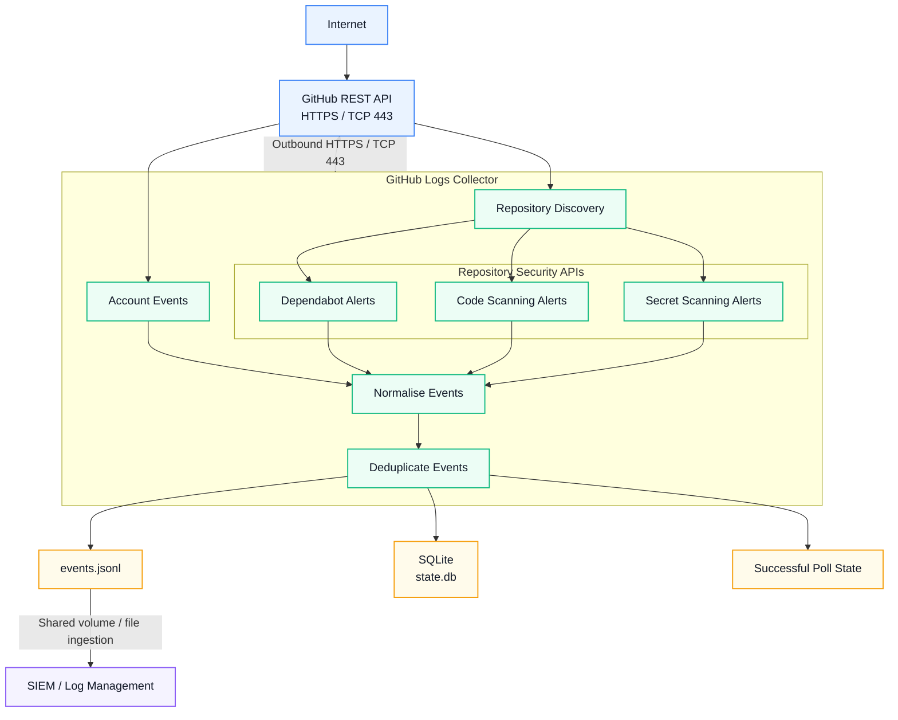
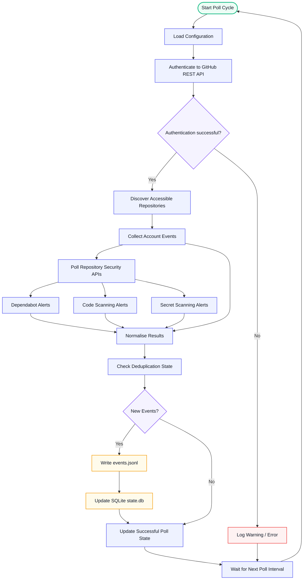

<p align="center">
  
</p>

<p align="center">
  <a href="https://github.com/webbie003/github-logs-collector/releases/latest"></a>&nbsp;
  <a href="https://github.com/webbie003/github-logs-collector/actions/workflows/docker-publish.yml"></a>&nbsp;
  <a href="https://www.python.org/"></a>&nbsp;
  <a href="https://alpinelinux.org/"></a>&nbsp;
  <a href="LICENSE"></a>
</p>

A lightweight, security-focused GitHub REST API polling collector for SIEM and log-management platforms.

GitHub Logs Collector securely authenticates to GitHub, retrieves account activity, discovers accessible repositories, collects supported repository security alerts, deduplicates events, and writes structured newline-delimited JSON (`JSONL`) for ingestion by downstream security platforms.

The project is intentionally **SIEM-Agnostic**.

---

## Quick Start

Pull the latest image from either supported registry.

| GitHub Container Registry [](https://github.com/users/webbie003/packages/container/package/github-logs-collector) | Docker Hub [](https://hub.docker.com/r/techie003/github-logs-collector) |
|:---|:---|
| **Latest image:** `docker pull ghcr.io/webbie003/github-logs-collector:latest` | **Latest image:** `docker pull techie003/github-logs-collector:latest` |
| **Specific image:** `docker pull ghcr.io/webbie003/github-logs-collector:0.2.1` | **Specific image:** `docker pull techie003/github-logs-collector:0.2.1` |

Both registries publish the same release image.

---

## Features

- Outbound-only GitHub REST API polling
- Authenticated GitHub account activity collection
- Repository discovery
- Public and private repository visibility where permitted
- Dependabot alert collection
- Code scanning alert collection
- Secret scanning alert collection
- Structured JSONL output
- Original GitHub API payload preservation
- Normalised metadata for SIEM searches and detection rules
- SQLite event deduplication
- Persistent collector state
- Successful-poll timestamp tracking
- Docker health monitoring based on actual polling progress
- GitHub API rate-limit awareness
- Bounded API pagination
- Configurable request timeout
- Configurable polling interval
- Graceful container shutdown
- Non-root execution
- Read-only root filesystem support
- All Linux capabilities can be dropped
- `no-new-privileges` support
- CPU, memory, and PID limits
- No published Docker ports required
- Alpine Linux runtime
- Runtime Python packaging tools removed after image construction
- Docker Compose deployment example
- GitHub security-feature setup guide
- Wazuh integration guide and example rules

---

### Collected Telemetry

GitHub Logs Collector collects and normalises:

- GitHub account activity
- Repository discovery data
- Dependabot alerts
- Code scanning alerts
- Secret scanning alerts

Collected telemetry is written locally as structured JSONL for downstream SIEM or log-management ingestion.

**No polled/collected telemetry from the Github is transmitted outside the container by the collector.** The collector only initiates outbound HTTPS connections to the GitHub REST API to retrieve data. Output remains within the configured log and state locations unless those files are explicitly mounted, shared, or ingested by the configured SIEM solution.

For details about each data source and its behaviour, see [Collection Sources](#collection-sources).

---

## Architecture



The collector is **outbound-only**.

It initiates all network connections to the GitHub REST API over HTTPS. GitHub does not establish inbound connections to the collector, and the collector does not require a publicly exposed listener or webhook endpoint.

---

## Polling Flow



Each polling cycle independently collects available GitHub activity and repository security telemetry, normalises the results, removes previously processed events, and writes new events as structured JSONL.

Repository security APIs are handled independently, allowing unavailable or unsupported security features to be skipped without terminating the entire polling cycle.

---

## Security Model

GitHub Logs Collector is designed to minimise its runtime attack surface.

The recommended deployment uses:

- Outbound HTTPS only
- No inbound listener
- No published Docker ports
- Fine-grained GitHub credentials
- Read-only GitHub permissions
- Dedicated non-root UID/GID
- Alpine Linux runtime
- Read-only container root filesystem
- `no-new-privileges`
- All Linux capabilities dropped
- Restricted writable persistent volumes
- Memory-backed `/tmp`
- PID limits
- CPU limits
- Memory limits
- Docker log rotation
- No interactive stdin
- No pseudo-terminal
- No Docker socket access
- Runtime Python packaging tooling removed

See:

```text
SECURITY.md
```

for the complete security policy and deployment guidance.

---

## Runtime Image Hardening

Version `0.2.1` migrates the runtime image from Debian-based Python slim images to:

```text
python:3.13.15-alpine3.24
```

This significantly reduces the number of operating-system packages included in the final container.

Python dependencies are installed during image construction using `pip`.

After dependency installation, `pip` is removed from the final runtime image.

This removes unnecessary package-management functionality and vendored libraries that are not required by the collector during normal operation.

The final runtime requires only the Python interpreter, Python standard-library components used by the collector, the configured application dependencies, TLS trust material, and the collector source.

A Trivy scan of the `0.2.1` Alpine runtime image during release testing reported:

```text
CRITICAL vulnerabilities: 0
HIGH vulnerabilities:     0
```

Vulnerability scanner results are point-in-time results and should not be treated as a guarantee that an image will remain vulnerability-free.

Images should be rebuilt and rescanned regularly.

---

## Repository Structure

<pre>
github-logs-collector/
│
├── .github/
│   └── workflows/
│       └── <a href=".github/workflows/docker-publish.yml">docker-publish.yml</a>
│
├── app/
│   ├── <a href="app/github_collector.py">github_collector.py</a>
│   └── <a href="app/healthcheck.py">healthcheck.py</a>
│
├── docs/
│   ├── images/
│   │   └── <a href="docs/images/ghlc_logo.png">ghlc_logo.png</a>
│   └── <a href="docs/GITHUB_SECURITY_SETUP.md">GITHUB_SECURITY_SETUP.md</a>
│
├── examples/
│   ├── docker-compose/
│   │   ├── <a href="examples/docker-compose/.env.example">.env.example</a>
│   │   └── <a href="examples/docker-compose/docker-compose.yml">docker-compose.yml</a>
│   │
│   └── wazuh/
│       ├── <a href="examples/wazuh/README.md">README.md</a>
│       ├── <a href="examples/wazuh/local_rules.xml">local_rules.xml</a>
│       └── <a href="examples/wazuh/ossec-localfile.xml">ossec-localfile.xml</a>
│
├── <a href="Dockerfile">Dockerfile</a>
├── <a href="requirements.txt">requirements.txt</a>
├── <a href=".dockerignore">.dockerignore</a>
├── <a href=".gitignore">.gitignore</a>
├── <a href="README.md">README.md</a>
├── <a href="SECURITY.md">SECURITY.md</a>  &lt;-- You are here.
├── <a href="CHANGELOG.md">CHANGELOG.md</a>
└── <a href="LICENSE">LICENSE</a>
</pre>

---

## Requirements

Container deployment requires:

- Docker
- Docker Compose v2
- A GitHub account
- A GitHub access token with required read permissions
- Outbound HTTPS access to `api.github.com`

No inbound Internet connectivity is required.

---

## GitHub Security Features

The collector can retrieve repository security alerts only when the corresponding GitHub feature is enabled and available.

Recommended baseline:

```text
Dependency graph                  Enabled
Dependabot alerts                 Enabled
Enable for future repositories    Enabled
Dependabot security updates       Optional
Secret scanning                   Enabled where available
Push protection                   Enabled where available
Code scanning / CodeQL            Enabled where available
```

Existing repositories should be reviewed individually because future-repository defaults do not necessarily enable features retrospectively.

Full instructions are available, see [GITHUB_SECURITY_SETUP.md](docs/GITHUB_SECURITY_SETUP.md)

---

## Collection Sources

### Account Activity

The collector retrieves GitHub events exposed to the authenticated account.

Examples may include:

```text
PushEvent
PullRequestEvent
IssuesEvent
IssueCommentEvent
CreateEvent
DeleteEvent
ReleaseEvent
ForkEvent
WatchEvent
```

Additional event types may be collected when returned by GitHub.

GitHub event APIs are not guaranteed to provide events in real time.

---

## Repository Discovery

The collector discovers repositories accessible to the configured GitHub account.

Depending on token permissions, these may include:

- Personally owned repositories
- Public repositories
- Private repositories
- Collaborator repositories
- Accessible organisation repositories

Successful repository discovery does not guarantee that every repository security API is enabled or available.

---

## Security Alerts

Where supported, GitHub Logs Collector polls:

```text
Dependabot alerts
Code scanning alerts
Secret scanning alerts
```

Security APIs may return `403` or `404` when a feature is disabled, unavailable, unsupported, or inaccessible.

These conditions are handled per repository so that one unavailable security API does not terminate the collector.

---

## GitHub Personal Account API Limitation

GitHub's complete personal-account Security Log is not exposed through an equivalent complete personal REST audit-log API.

GitHub Logs Collector therefore cannot reproduce every security event visible through GitHub's personal-account web interface.

Organisation and enterprise GitHub environments may provide richer audit-log capabilities.

---

## GitHub Authentication

A fine-grained GitHub personal access token should be used where possible.

The collector is designed for **read-only access**.

Recommended permissions include:

### Account Permissions

```text
Events: Read
```

### Repository Permissions

```text
Metadata: Read
Dependabot alerts: Read
Code scanning alerts: Read
Secret scanning alerts: Read
```

Grant only permissions required by your deployment.

Do not grant write or administration permissions unless a future collector feature explicitly requires them.

---

## Deployment

### 1. Enable GitHub Security Features

Review the [GITHUB_SECURITY_SETUP](docs/GITHUB_SECURITY_SETUP.md) for assistance enabling the repository security products that you intend to monitor.

### 2. Clone

```bash
git clone git@github.com:webbie003/github-logs-collector.git

cd github-logs-collector
```

### 3. Configure

```bash
cd examples/docker-compose

cp .env.example .env

chmod 600 .env
```

Edit `.env` and configure:

```env
GITHUB_USERNAME=YOUR_GITHUB_USERNAME
GITHUB_TOKEN=YOUR_GITHUB_TOKEN
```

### 4. Start

```bash
docker compose up -d
```

Check:

```bash
docker compose ps
```

View collector logs:

```bash
docker logs github-logs-collector
```

---

## Environment Configuration

Example:

```env
COLLECTOR_VERSION=0.2.1

GITHUB_USERNAME=YOUR_GITHUB_USERNAME
GITHUB_TOKEN=CHANGE_ME

POLL_INTERVAL=300
REQUEST_TIMEOUT=20
MAX_PAGES=10

GITHUB_LOG_FILE=/var/log/github/events.jsonl
STATE_DATABASE=/var/lib/github-logs-collector/state.db
LAST_SUCCESS_FILE=/var/lib/github-logs-collector/last_successful_poll

HEALTH_MAX_AGE=900

GITHUB_API_URL=https://api.github.com

LOG_LEVEL=INFO
```

### Variables

| Variable | Description | Default |
|---|---|---|
| `COLLECTOR_VERSION` | Container image version | `0.2.1` |
| `GITHUB_USERNAME` | GitHub account monitored by the collector | Required |
| `GITHUB_TOKEN` | GitHub authentication token | Required |
| `POLL_INTERVAL` | Delay between polling cycles | `300` |
| `REQUEST_TIMEOUT` | GitHub HTTP timeout in seconds | `20` |
| `MAX_PAGES` | Maximum API pages retrieved per source | `10` |
| `GITHUB_LOG_FILE` | JSONL output path | `/var/log/github/events.jsonl` |
| `STATE_DATABASE` | SQLite state database | `/var/lib/github-logs-collector/state.db` |
| `LAST_SUCCESS_FILE` | Last successful poll timestamp | `/var/lib/github-logs-collector/last_successful_poll` |
| `HEALTH_MAX_AGE` | Maximum acceptable successful-poll age | `900` |
| `GITHUB_API_URL` | GitHub REST API base URL | `https://api.github.com` |
| `LOG_LEVEL` | Operational logging level | `INFO` |

---

## Protecting `.env`

The real `.env` contains authentication material and must never be committed.

Recommended permissions:

```bash
chmod 600 .env
```

Before committing:

```bash
git check-ignore .env
git status --ignored
git diff --cached
```

---

## Polling

The default polling interval is:

```env
POLL_INTERVAL=300
```

A normal cycle performs:

```text
Verify GitHub identity
        │
        ▼
Collect account events
        │
        ▼
Discover repositories
        │
        ▼
Collect supported security alerts
        │
        ▼
Deduplicate events
        │
        ▼
Write new JSONL records
        │
        ▼
Update successful-poll timestamp
        │
        ▼
Sleep
```

---

## Event Deduplication

The collector stores processed event identifiers in:

```text
/var/lib/github-logs-collector/state.db
```

SQLite state is stored on a persistent Docker volume.

Deleting the state volume resets deduplication history and may cause previously available events to be collected again.

---

## Successful Poll State

After a complete successful polling cycle, the collector updates:

```text
/var/lib/github-logs-collector/last_successful_poll
```

This provides an external indication that the collector is continuing to make progress.

---

## Docker Health Monitoring

Version `0.2.1` includes a Docker health check based on the age of the most recent successfully completed polling cycle.

The health check does **not** merely verify that the Python process exists.

Default configuration:

```env
POLL_INTERVAL=300
HEALTH_MAX_AGE=900
```

The collector can therefore miss approximately three normal polling intervals before the successful-poll timestamp is considered stale.

This can detect conditions where:

- the Python process is still running but polling has stalled
- repeated GitHub API failures prevent complete polling cycles
- persistent state operations repeatedly fail
- the application remains alive but is no longer making useful progress

Check health:

```bash
docker compose ps github-logs-collector
```

Inspect detailed health results:

```bash
docker inspect github-logs-collector \
  --format '{{json .State.Health}}' |
python3 -m json.tool
```

Run the probe manually:

```bash
docker exec github-logs-collector \
  python /app/healthcheck.py
```

Example:

```text
HEALTHY: last successful poll 143 seconds ago
```

Docker's health status is informational by itself. Docker Engine does not automatically restart an otherwise running container simply because its health state changes to `unhealthy`.

---

## JSONL Output

Default output:

```text
/var/log/github/events.jsonl
```

Each physical line contains one complete JSON object.

Example:

```json
{
  "@timestamp": "2026-08-12T03:00:00Z",
  "collector": {
    "name": "github-logs-collector",
    "mode": "poll"
  },
  "source": {
    "type": "github",
    "dataset": "account_event"
  },
  "github": {
    "event_id": "123456789",
    "event": "PushEvent",
    "repository": "example/example-repository",
    "actor": "example-user",
    "public": false
  },
  "payload": {
    "...": "Original GitHub API object"
  }
}
```

---

## Normalised Fields

Examples include:

```text
collector.name
collector.mode

source.type
source.dataset

github.event_id
github.event
github.repository
github.actor
github.public
github.alert_number
github.state
```

The original GitHub response object is retained under:

```text
payload
```

Collected data may contain sensitive repository information and should be protected accordingly.

---

## Docker Deployment

The generic deployment example is located at:

```text
examples/docker-compose/
```

Published images are available from both registries:

```text
GHCR:
ghcr.io/webbie003/github-logs-collector

Docker Hub:
techie003/github-logs-collector
```

Example:

```yaml
image: ghcr.io/webbie003/github-logs-collector:${COLLECTOR_VERSION:-0.2.1}
```
OR
```yaml
image: techie003/github-logs-collector:${COLLECTOR_VERSION:-0.2.1}
```

No Docker ports are required or port forward is required.

---

## Persistent Volumes

Event output:

```text
/var/log/github
```

Collector state:

```text
/var/lib/github-logs-collector
```

Example:

```yaml
volumes:
  - github_logs:/var/log/github
  - github_state:/var/lib/github-logs-collector
```

Both volumes should persist across container recreation and upgrades.

---

## Container Hardening

Recommended Compose controls include:

```yaml
security_opt:
  - no-new-privileges:true

cap_drop:
  - ALL

read_only: true

tmpfs:
  - /tmp:size=16M,mode=1777

pids_limit: 50

mem_limit: 128m

cpus: 0.25

stdin_open: false
tty: false
```

The container does not require:

- privileged mode
- host networking
- Docker socket access
- published TCP/UDP ports
- Linux capabilities
- root runtime execution

---

## Runtime Package Management

`pip` is required only during image construction and is removed from the final runtime image as part of the project's attack-surface reduction strategy.

See [Runtime Image Hardening](#runtime-image-hardening).

---

## Vulnerability Scanning

Container images are scanned automatically during the release pipeline before publication.

Example using Trivy:

```bash
trivy image \
  --severity CRITICAL,HIGH \
  github-logs-collector:0.2.1
```

The `0.2.1` release candidate was validated with Trivy after migration to Alpine and removal of runtime packaging tooling.

Release testing produced no detected `CRITICAL` or `HIGH` vulnerabilities at the time of scanning.

Scanner databases and vulnerability information change over time, so future scans may produce different results.

---

## GitHub API Failures

The collector distinguishes between:

- authentication failures
- GitHub rate limiting
- network and HTTP failures
- repository-specific security-feature availability

Unavailable security APIs do not terminate collection from otherwise accessible repositories.

Temporary API failures are retried by later polling cycles.

---

## Troubleshooting

Default:

```env
LOG_LEVEL=INFO
```

Troubleshooting:

```env
LOG_LEVEL=DEBUG
```

DEBUG logging should normally be returned to INFO after troubleshooting.

Authentication tokens and Authorization headers must never be intentionally logged.

---

## Building Locally

```bash
docker build \
  --pull \
  --no-cache \
  -t github-logs-collector:0.2.1 \
  .
```

Verify runtime identity:

```bash
docker image inspect \
  github-logs-collector:0.2.1 \
  --format '{{.Config.User}}'
```

Expected:

```text
10001:10001
```

---

## Runtime Validation

Inspect container security configuration:

```bash
docker inspect github-logs-collector \
  --format 'User={{.Config.User}} ReadonlyRootfs={{.HostConfig.ReadonlyRootfs}} CapDrop={{.HostConfig.CapDrop}}'
```

Check that no ports are published:

```bash
docker port github-logs-collector
```

No mappings should normally be returned.

---

## Wazuh Integration

Complete Wazuh integration instructions are maintained separately in the [README.md](examples/wazuh/README.md)

Example configuration files:
- [ossec-localfile.xml](examples/wazuh/ossec-localfile.xml)
- [local_rules.xml](examples/wazuh/local_rules.xml)

---

## Data Sensitivity

Collected telemetry may contain:

- private repository names
- branch names
- commit metadata
- GitHub usernames
- pull request information
- issue information
- dependency vulnerabilities
- code scanning findings
- secret scanning findings
- internal project names

Protect the JSONL output and downstream SIEM storage accordingly.

---

## Current Limitations

- GitHub event data may not be real-time.
- GitHub's complete personal Security Log is not exposed through an equivalent complete personal-account audit API.
- Security API availability depends on the corresponding GitHub security feature.
- Feature availability may depend on repository visibility and GitHub plan.
- API visibility depends on token permissions.
- Historical availability is limited by GitHub APIs.
- The collector is designed for continuing collection rather than unlimited historical archival.
- The collector performs no write actions against GitHub.

---

## Documentation

GitHub security setup [GITHUB_SECURITY_SETUP.md](docs/GITHUB_SECURITY_SETUP.md)
Security policy: [SECURITY.md](SECURITY.md)
Wazuh integration: [README.md](examples/wazuh/README.md)
Release history: [CHANGELOG.md](CHANGELOG.md)

---

## Licence

GitHub Logs Collector is licensed under the [MIT License](LICENSE).
