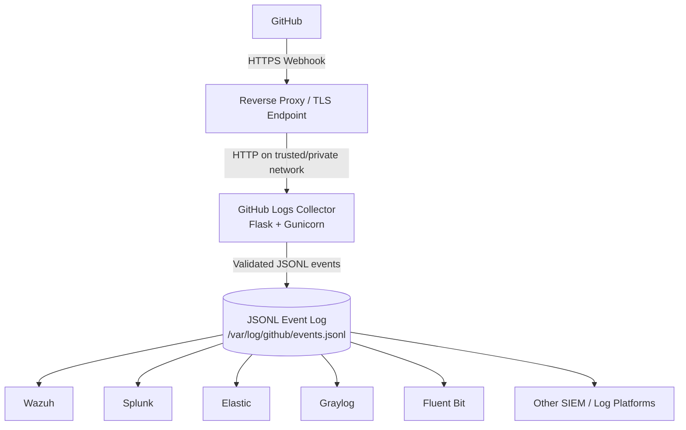

# GitHub Logs Collector

A lightweight, security-focused GitHub webhook collector that validates signed GitHub events and writes structured JSONL for ingestion by SIEM and log-management platforms.

The collector is intentionally **SIEM-neutral**. It can be used with Wazuh, Splunk, Elastic, Graylog, Fluent Bit, Vector, or any other platform capable of ingesting JSONL log data.

## Features

* GitHub webhook ingestion
* HMAC-SHA256 webhook signature validation
* Constant-time signature comparison
* Structured newline-delimited JSON output
* Preserves the original GitHub webhook payload
* Normalised event metadata for easier SIEM searching
* Maximum request-body limits
* JSON-only webhook processing
* Metadata length validation
* Gunicorn production application server
* Runs as a dedicated non-root user
* Supports read-only container root filesystem
* Linux capabilities can be completely dropped
* `no-new-privileges` support
* CPU, memory, PID, and log-rotation controls
* Built-in health endpoint
* Docker Compose deployment example
* Wazuh integration examples
* No dependency on a specific SIEM platform

---

## Architecture



The recommended deployment model terminates TLS at a trusted reverse proxy and keeps the collector itself on a private or trusted network.

---

## Security Model

The collector is designed as an internet-facing security-sensitive service.

Security controls are implemented at both the application and container layers.

### Webhook Authentication

GitHub webhook requests are validated using the `X-Hub-Signature-256` header.

The collector:

1. Reads the original raw HTTP request body.
2. Calculates an HMAC-SHA256 digest using the configured webhook secret.
3. Compares the calculated signature using `hmac.compare_digest()`.
4. Rejects unsigned or incorrectly signed webhook requests.
5. Processes and writes an event only after authentication succeeds.

### Request Validation

The application:

* Accepts only JSON webhook requests.
* Enforces a configurable maximum request-body size.
* Validates GitHub event names.
* Restricts metadata field lengths.
* Rejects malformed JSON.
* Requires webhook payloads to contain a JSON object.

### Secret Protection

The GitHub webhook secret is supplied at runtime and must not be stored in:

* Source code
* Git repositories
* Container images
* Application logs

Generate a strong webhook secret with:

```bash
openssl rand -hex 32
```

### Container Hardening

The recommended Docker Compose configuration uses:

* Dedicated non-root UID/GID
* `no-new-privileges:true`
* `cap_drop: ALL`
* Read-only root filesystem
* Restricted writable log volume
* Memory-backed `/tmp`
* Process limits
* CPU limits
* Memory limits
* Docker log rotation
* No interactive stdin
* No pseudo-terminal
* Minimal init process
* Health monitoring

---

## Repository Layout

```text
github-logs-collector/
├── app/
│   └── github_listener.py
│
├── examples/
│   ├── docker-compose/
│   │   ├── docker-compose.yml
│   │   └── .env.example
│   │
│   └── wazuh/
│       ├── local_rules.xml
│       └── ossec-localfile.xml
│
├── tests/
├── Dockerfile
├── requirements.txt
├── .dockerignore
├── .gitignore
├── README.md
├── SECURITY.md
└── LICENSE
```

---

## Requirements

For container deployment:

* Docker
* Docker Compose v2
* A GitHub repository or organisation where webhook configuration is permitted
* An HTTPS endpoint reachable by GitHub for production webhook delivery

A reverse proxy such as nginx, Caddy, Traefik, HAProxy, or another ingress solution is recommended for TLS termination.

---

## Quick Start

Clone the repository:

```bash
git clone git@github.com:webbie003/github-logs-collector.git

cd github-logs-collector
```

Copy the example environment file:

```bash
cp examples/docker-compose/.env.example \
   examples/docker-compose/.env
```

Generate a webhook secret:

```bash
openssl rand -hex 32
```

Edit:

```text
examples/docker-compose/.env
```

and replace:

```env
GITHUB_WEBHOOK_SECRET=CHANGE_ME
```

with the generated value.

Then start the collector:

```bash
cd examples/docker-compose

docker compose up -d
```

Check the container:

```bash
docker compose ps
```

Check the health endpoint:

```bash
curl http://127.0.0.1:8080/health
```

Expected response:

```json
{"status":"healthy"}
```

---

## Environment Configuration

Example:

```env
COLLECTOR_VERSION=0.1.1

COLLECTOR_BIND_IP=127.0.0.1

GITHUB_WEBHOOK_SECRET=CHANGE_ME

GITHUB_WEBHOOK_LOG=/var/log/github/events.jsonl

MAX_CONTENT_LENGTH=5242880

LOG_LEVEL=INFO
```

### Configuration Variables

| Variable                | Description                                           | Default                        |
| ----------------------- | ----------------------------------------------------- | ------------------------------ |
| `COLLECTOR_VERSION`     | Container image version                               | `0.1.1`                        |
| `COLLECTOR_BIND_IP`     | Docker host interface used to publish port 8080       | `127.0.0.1`                    |
| `GITHUB_WEBHOOK_SECRET` | Secret used to authenticate GitHub webhook deliveries | Required                       |
| `GITHUB_WEBHOOK_LOG`    | JSONL event log location                              | `/var/log/github/events.jsonl` |
| `MAX_CONTENT_LENGTH`    | Maximum accepted HTTP request body in bytes           | `5242880`                      |
| `LOG_LEVEL`             | Application logging verbosity                         | `INFO`                         |

### Bind Address

The example defaults to:

```env
COLLECTOR_BIND_IP=127.0.0.1
```

This prevents the collector from accidentally being exposed on every network interface.

If direct LAN access is required, use a specific server address:

```env
COLLECTOR_BIND_IP=10.1.1.1
```

Avoid publishing the collector directly to `0.0.0.0` unless the network exposure is intentional and adequately protected.

---

## Docker Deployment

The example Docker Compose deployment is located at:

```text
examples/docker-compose/
```

The container image is expected to be published as:

```text
ghcr.io/webbie003/github-logs-collector
```

Example:

```yaml
services:
  github-logs-collector:
    image: ghcr.io/webbie003/github-logs-collector:${COLLECTOR_VERSION:-0.1.1}
```

The hardened Compose example also applies:

```yaml
security_opt:
  - no-new-privileges:true

cap_drop:
  - ALL

read_only: true

pids_limit: 100

mem_limit: 128m

cpus: 0.50

stdin_open: false
tty: false
```

---

## Existing SIEM Docker Networks

Docker Compose creates a default network automatically.

If the collector must communicate directly with containers on an existing SIEM Docker network, attach it to that network.

Example service configuration:

```yaml
networks:
  - wazuh-backend
```

Then declare the existing network:

```yaml
networks:
  wazuh-backend:
    external: true
```

The network must already exist when `external: true` is used.

For log-file based ingestion, direct network connectivity between the collector and SIEM may not be required.

---

## GitHub Webhook Configuration

Configure a webhook for the repository or organisation you want to monitor.

Use:

```text
Payload URL:
https://YOUR_PUBLIC_HOST/github-webhook

Content type:
application/json

Secret:
Same value as GITHUB_WEBHOOK_SECRET

SSL verification:
Enabled
```

For initial testing, select the required GitHub event types.

The collector receives events through:

```text
POST /github-webhook
```

and validates the GitHub HMAC signature before storing the event.

---

## Event Processing

The processing flow is:

```text
GitHub webhook
      |
      v
Validate content type
      |
      v
Read raw request body
      |
      v
Verify HMAC-SHA256 signature
      |
      v
Validate GitHub metadata
      |
      v
Parse JSON payload
      |
      v
Normalise common fields
      |
      v
Write one JSON object per line
      |
      v
SIEM / Log Platform
```

Unsigned or incorrectly signed events are rejected and are not written to the event log.

---

## Log Output

By default, events are written to:

```text
/var/log/github/events.jsonl
```

The format is newline-delimited JSON.

Example:

```json
{
  "@timestamp": "2026-08-12T03:00:00+00:00",
  "source": {
    "type": "github",
    "transport": "webhook"
  },
  "github": {
    "event": "push",
    "delivery_id": "12345678-abcd-1234-abcd-123456789abc",
    "hook_id": "123456789",
    "repository": "example/example-repository",
    "organization": null,
    "sender": "example-user",
    "action": null
  },
  "payload": {
    "...": "Original GitHub webhook payload"
  }
}
```

The actual file contains one complete JSON object per physical line.

This makes it suitable for ingestion by log collectors and SIEM platforms.

---

## Why Preserve the Full Payload?

GitHub webhook payload structures vary substantially depending on event type.

The collector therefore provides two layers of information:

### Normalised Metadata

Common fields are extracted for easy searching:

```text
github.event
github.delivery_id
github.hook_id
github.repository
github.organization
github.sender
github.action
```

### Original Payload

The complete original GitHub JSON object is retained under:

```text
payload
```

This allows downstream SIEM rules and searches to use event-specific fields without requiring the collector to understand every possible GitHub event type.

---

## Wazuh Integration

Example Wazuh configuration is available under:

```text
examples/wazuh/
```

### Log Collection

Add the supplied `<localfile>` configuration to the Wazuh manager:

```xml
<localfile>
  <log_format>json</log_format>
  <location>/var/log/github/events.jsonl</location>
</localfile>
```

Where possible, provide Wazuh read-only access to the collector log volume.

Example:

```yaml
volumes:
  - github_logs:/var/log/github:ro
```

### Example Rules

Example custom Wazuh rules are provided in:

```text
examples/wazuh/local_rules.xml
```

These demonstrate detections for events such as:

* Git pushes
* Repository changes
* Repository membership events
* GitHub Actions workflow events
* Secret scanning alerts
* Code scanning alerts
* Dependabot alerts

Review custom rule IDs before deployment to ensure they do not conflict with existing Wazuh custom rules.

---

## Health Monitoring

The collector exposes:

```text
GET /health
```

Successful response:

```json
{"status":"healthy"}
```

The health endpoint intentionally does not disclose:

* Environment variables
* Webhook secrets
* Package versions
* Filesystem paths
* Internal configuration
* Stack traces

---

## Building Locally

Build the image:

```bash
docker build \
  --pull \
  --no-cache \
  -t github-logs-collector:0.1.1 \
  .
```

Verify the image:

```bash
docker image ls github-logs-collector
```

Confirm the runtime user:

```bash
docker image inspect \
  github-logs-collector:0.1.1 \
  --format '{{.Config.User}}'
```

Expected:

```text
10001:10001
```

---

## Production Deployment Recommendations

For production use:

1. Terminate HTTPS at a trusted reverse proxy or ingress service.
2. Do not expose Flask's development server.
3. Keep `GITHUB_WEBHOOK_SECRET` outside source control.
4. Use a strong randomly generated webhook secret.
5. Run the container with `cap_drop: ALL`.
6. Enable `no-new-privileges`.
7. Keep the root filesystem read-only.
8. Limit writable storage to the log volume.
9. Restrict CPU, memory, and process usage.
10. Restrict access to collected GitHub event logs.
11. Keep TLS certificate verification enabled in GitHub.
12. Pin container versions rather than relying on `latest`.

---

## Threat Model

The collector assumes that its HTTP endpoint may receive arbitrary internet traffic.

The design therefore focuses on:

* Authenticating GitHub webhook requests
* Rejecting malformed input
* Limiting resource consumption
* Minimising container privileges
* Reducing writable filesystem access
* Protecting webhook secrets
* Preventing unnecessary information disclosure
* Preserving sufficient event information for incident investigation

The collector does not consider an event trustworthy solely because it contains GitHub-looking JSON. A valid HMAC signature is required.

---

## Current Limitations

The collector currently focuses on **GitHub webhook events**.

It does not currently poll GitHub account security logs or organisation audit APIs.

Personal account security events such as authentication activity, token management, SSH key changes, or other account-level security events may require an additional GitHub API collector in a future release.

Webhook delivery IDs are retained for correlation, but automatic replay suppression is not currently performed because legitimate GitHub redelivery can be useful during troubleshooting and SIEM investigation.

---

## Security

See:

```text
SECURITY.md
```

Do not report suspected security vulnerabilities through a public GitHub issue.

Where available, use GitHub Private Vulnerability Reporting.

---

## Licence

This project is licensed under the MIT License.

See:

```text
LICENSE
```

---

## Project Goals

GitHub Logs Collector aims to remain:

* Lightweight
* Secure by default
* Easy to deploy
* SIEM-neutral
* Transparent
* Easy to audit
* Suitable for homelab and production use
* Extensible for future GitHub security telemetry sources
