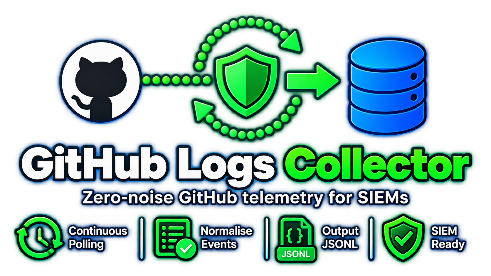
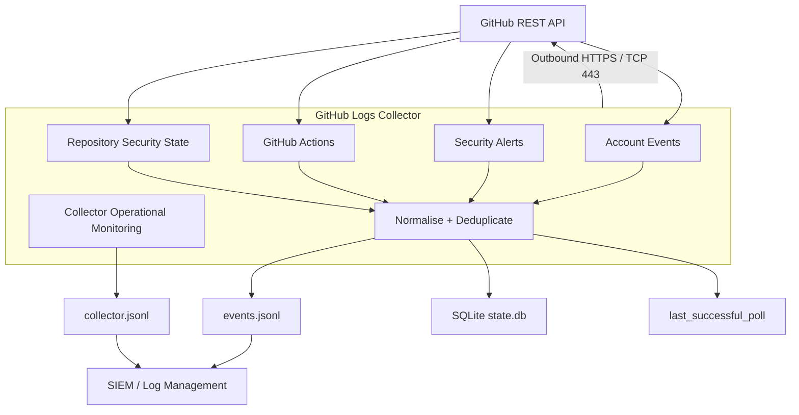
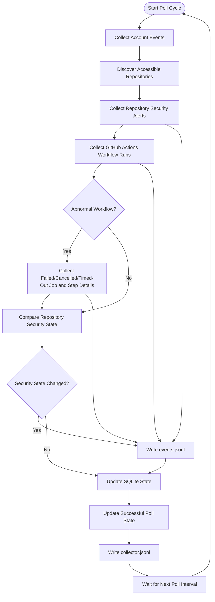

<p align="center">
  
</p>

<p align="center">
  <a href="https://github.com/webbie003/github-logs-collector/releases/latest"></a>&nbsp;
  <a href="https://github.com/webbie003/github-logs-collector/actions/workflows/docker-publish.yml"></a>&nbsp;
  <a href="docs/SECURITY-STATUS.md"></a>&nbsp;
  <a href="https://www.python.org/"></a>&nbsp;
  <a href="https://alpinelinux.org/"></a>&nbsp;
  <a href="LICENSE"></a>
</p>

A hardened GitHub REST API poller that turns personal account activity and security telemetry into normalised, deduplicated, SIEM-ready JSONL for monitoring, detection, and investigation.

GitHub Logs Collector securely authenticates to GitHub, retrieves account activity, discovers accessible repositories, collects supported repository security alerts, monitors GitHub Actions and selected security-relevant repository state, deduplicates events, and writes structured newline-delimited JSON (`JSONL`) for downstream security platforms.

The project is intentionally **SIEM-neutral**.

---

## Quick Start

Pull the latest image from either supported registry.

| GitHub Container Registry [](https://github.com/users/webbie003/packages/container/package/github-logs-collector) | Docker Hub [](https://hub.docker.com/r/techie003/github-logs-collector) |
|:---|:---|
| **Latest image:** `docker pull ghcr.io/webbie003/github-logs-collector:latest` | **Latest image:** `docker pull techie003/github-logs-collector:latest` |
| **Specific image:** `docker pull ghcr.io/webbie003/github-logs-collector:0.2.2` | **Specific image:** `docker pull techie003/github-logs-collector:0.2.2` |

Both registries publish the same release image.

---

## Features

- Outbound-only GitHub REST API polling
- Authenticated GitHub account activity collection
- Repository discovery
- Public and private repository visibility where permitted
- Dependabot alert collection
- Code scanning alert collection
- Secret scanning alert collection
- Security-alert lifecycle monitoring
- GitHub Actions workflow monitoring
- Workflow actor and triggering-actor attribution
- Failed, cancelled, timed-out and other abnormal Actions job/step monitoring
- Security-relevant repository state monitoring
- Structured JSONL output
- Separate collector operational/security JSONL stream
- Original GitHub API payload preservation
- Normalised metadata for SIEM searches and detection rules
- SQLite event deduplication
- Persistent collector state
- Repository security-state baselines
- Successful-poll timestamp tracking
- Docker health monitoring based on actual polling progress
- GitHub API rate-limit awareness
- Bounded API pagination
- Configurable request timeout
- Configurable polling interval
- Graceful container shutdown
- Non-root execution
- Read-only root filesystem support
- All Linux capabilities can be dropped
- `no-new-privileges` support
- CPU, memory and PID limits
- No published Docker ports required
- Alpine Linux runtime
- Runtime Python packaging tools removed after image construction
- Docker Compose deployment example
- GitHub security-feature setup guide
- Wazuh integration guide and example rules

---

### Collected Telemetry

GitHub Logs Collector collects security-relevant telemetry including:

- GitHub account activity
- Repository push, pull request, create, delete, release and fork activity
- Dependabot alerts
- Code scanning alerts
- Secret scanning alerts
- Security-alert lifecycle changes
- GitHub Actions workflow execution
- Workflow actor and triggering actor
- Workflow branch, tag and commit SHA
- Failed, cancelled and timed-out workflow activity
- Abnormal GitHub Actions job and step outcomes
- Repository visibility changes
- Private/public state changes
- Archive-state changes
- Default-branch changes
- Collector operational warnings and failures

Collected GitHub telemetry is written locally as structured JSONL for downstream SIEM or log-management ingestion.

**No collected telemetry is transmitted to another external service by the collector.** The collector only initiates outbound HTTPS requests to the GitHub REST API.

See [Collection Sources](#collection-sources) for detailed source information.

---

## Architecture



The collector is **outbound-only**.

It initiates all network connections to the GitHub REST API over HTTPS. GitHub does not establish inbound connections to the collector, and the collector does not require a publicly exposed listener or webhook endpoint.

---

## Polling Flow



Each polling cycle independently collects available GitHub activity and repository security telemetry, records workflow activity, captures abnormal GitHub Actions job/step outcomes, compares security-relevant repository state, deduplicates event data, and updates persistent state.

Repository security APIs are handled independently so unavailable or unsupported features can be skipped without terminating the entire polling cycle.

---

## Security Model

GitHub Logs Collector is designed to minimise its runtime attack surface.

The recommended deployment uses:

- Outbound HTTPS only
- No inbound listener
- No published Docker ports
- Fine-grained GitHub credentials
- Read-only GitHub permissions
- Dedicated non-root UID/GID
- Alpine Linux runtime
- Read-only container root filesystem
- `no-new-privileges`
- All Linux capabilities dropped
- Restricted writable persistent volumes
- Memory-backed `/tmp`
- PID limits
- CPU limits
- Memory limits
- Docker log rotation
- No interactive stdin
- No pseudo-terminal
- No Docker socket access
- Runtime Python packaging tooling removed

See the [Security Policy](SECURITY.md) for complete security and deployment guidance.

---

## Container Security Status

Container images are scanned automatically with Trivy as part of the project security workflow.

The latest automatically generated vulnerability summary is available in:

[**Container Security Status**](docs/SECURITY-STATUS.md)

Release publication is blocked when a release candidate contains `CRITICAL` or `HIGH` vulnerability findings.

High and Critical findings are also uploaded to GitHub Code Scanning where supported.

Security scan results are point-in-time assessments and may change as vulnerability databases and upstream advisories are updated.

---

## Runtime Image Hardening

Version `0.2.1` migrated the runtime image from Debian-based Python slim images to:

```text
python:3.13.15-alpine3.24
```

This significantly reduced the number of operating-system packages included in the final container.

Python dependencies are installed during image construction using `pip`.

After dependency installation, `pip` is removed from the final runtime image.

This removes unnecessary package-management functionality and vendored libraries that are not required by the collector during normal operation.

The final runtime requires only the Python interpreter, standard-library components used by the collector, configured application dependencies, TLS trust material and collector source.

A Trivy scan of the `0.2.1` Alpine runtime image during release testing reported:

```text
CRITICAL vulnerabilities: 0
HIGH vulnerabilities:     0
```

Vulnerability scanner results are point-in-time results and should not be treated as a guarantee that an image will remain vulnerability-free.

Images should be rebuilt and rescanned regularly.

---

## Repository Structure

<pre>
github-logs-collector/
│
├── .github/
│   └── workflows/
│       └── <a href=".github/workflows/docker-publish.yml">docker-publish.yml</a>
│
├── app/
│   ├── <a href="app/github_collector.py">github_collector.py</a>
│   └── <a href="app/healthcheck.py">healthcheck.py</a>
│
├── docs/
│   ├── images/
│   │   └── <a href="docs/images/ghlc_logo.png">ghlc_logo.png</a>
│   ├── <a href="docs/GITHUB_SECURITY_SETUP.md">GITHUB_SECURITY_SETUP.md</a>
│   └── <a href="docs/SECURITY-STATUS.md">SECURITY-STATUS.md</a>
│
├── examples/
│   ├── docker-compose/
│   │   ├── <a href="examples/docker-compose/.env.example">.env.example</a>
│   │   └── <a href="examples/docker-compose/docker-compose.yml">docker-compose.yml</a>
│   │
│   └── wazuh/
│       ├── <a href="examples/wazuh/README.md">README.md</a>
│       ├── <a href="examples/wazuh/local_rules.xml">local_rules.xml</a>
│       └── <a href="examples/wazuh/ossec-localfile.xml">ossec-localfile.xml</a>
│
├── <a href="Dockerfile">Dockerfile</a>
├── <a href="requirements.txt">requirements.txt</a>
├── <a href=".dockerignore">.dockerignore</a>
├── <a href=".gitignore">.gitignore</a>
├── <a href="README.md">README.md</a>  &lt;-- You are here.
├── <a href="SECURITY.md">SECURITY.md</a>
├── <a href="CHANGELOG.md">CHANGELOG.md</a>
└── <a href="LICENSE">LICENSE</a>
</pre>

---

## Requirements

Container deployment requires:

- Docker
- Docker Compose v2
- A GitHub account
- A GitHub access token with required read permissions
- Outbound HTTPS access to `api.github.com`

No inbound Internet connectivity is required.

---

## GitHub Security Features

The collector can retrieve repository security alerts only when the corresponding GitHub feature is enabled and available.

Recommended baseline:

```text
Dependency graph                  Enabled
Dependabot alerts                 Enabled
Enable for future repositories    Enabled
Dependabot security updates       Optional
Secret scanning                   Enabled where available
Push protection                   Enabled where available
Code scanning / CodeQL            Enabled where available
```

Existing repositories should be reviewed individually because future-repository defaults do not necessarily enable features retrospectively.

Full instructions are available in [GITHUB_SECURITY_SETUP.md](docs/GITHUB_SECURITY_SETUP.md).

---

## Collection Sources

### Account Activity

The collector retrieves GitHub events exposed to the authenticated account.

Examples may include:

```text
PushEvent
PullRequestEvent
IssuesEvent
IssueCommentEvent
CreateEvent
DeleteEvent
ReleaseEvent
ForkEvent
WatchEvent
```

Additional event types may be collected when returned by GitHub.

GitHub event APIs are not guaranteed to provide events in real time.

---

### Repository Discovery

The collector discovers repositories accessible to the configured GitHub account.

Depending on token permissions, these may include:

- Personally owned repositories
- Public repositories
- Private repositories
- Collaborator repositories
- Accessible organisation repositories

Successful repository discovery does not guarantee every repository security API is enabled or available.

---

### Security Alerts

Where supported, GitHub Logs Collector polls:

```text
Dependabot alerts
Code scanning alerts
Secret scanning alerts
```

Security alert lifecycle changes are recorded where exposed by the respective GitHub API.

Security APIs may return `403` or `404` when a feature is disabled, unavailable, unsupported or inaccessible.

These conditions are handled per repository so one unavailable security API does not terminate the collector.

---

### GitHub Actions

The collector monitors recent GitHub Actions workflow runs for accessible repositories.

Normal workflow-run telemetry includes:

```text
workflow name
workflow run ID
workflow ID
run number
run attempt
trigger event
status
conclusion
branch/tag
commit SHA
actor
triggering actor
```

Successful workflow runs are recorded without emitting separate successful job/step events.

Detailed job and step telemetry is focused on abnormal workflow outcomes such as:

```text
failure
cancelled
timed_out
stale
action_required
startup_failure
```

Raw GitHub Actions console logs are not downloaded.

---

### Repository Security State

The collector monitors only repository state with clear security relevance:

```text
visibility
private/public state
archived/unarchived state
default branch
```

The first observation creates a persistent baseline and does not generate a change event.

Later changes generate `repository_security_state` events containing before/after values.

---

## GitHub Personal Account API Limitation

GitHub's complete personal-account Security Log is not exposed through an equivalent complete personal REST audit-log API.

GitHub Logs Collector therefore cannot reproduce every security event visible through GitHub's personal-account web interface.

Organisation and enterprise GitHub environments may provide richer audit-log capabilities.

---

## GitHub Authentication

A fine-grained GitHub personal access token should be used where possible.

The collector is designed for **read-only access**.

### Account Permissions

```text
Events: Read
```

### Repository Permissions

```text
Metadata: Read
Actions: Read
Dependabot alerts: Read
Code scanning alerts: Read
Secret scanning alerts: Read
```

Grant only permissions required by your deployment.

`Actions: Read` is required only when GitHub Actions telemetry is enabled.

Do not grant write or administration permissions unless a future collector feature explicitly requires them.

---

## Deployment

### 1. Enable GitHub Security Features

Review [GITHUB_SECURITY_SETUP.md](docs/GITHUB_SECURITY_SETUP.md) for assistance enabling the repository security products you intend to monitor.

### 2. Clone

```bash
git clone git@github.com:webbie003/github-logs-collector.git
cd github-logs-collector
```

### 3. Configure

```bash
cd examples/docker-compose

cp .env.example .env
chmod 600 .env
```

Edit `.env` and configure:

```env
GITHUB_USERNAME=YOUR_GITHUB_USERNAME
GITHUB_TOKEN=YOUR_GITHUB_TOKEN
```

### 4. Start

```bash
docker compose up -d
```

Check:

```bash
docker compose ps
```

View collector logs:

```bash
docker logs github-logs-collector
```

---

## Environment Configuration

Example:

```env
COLLECTOR_VERSION=0.2.2

GITHUB_USERNAME=YOUR_GITHUB_USERNAME
GITHUB_TOKEN=CHANGE_ME
GITHUB_API_URL=https://api.github.com

POLL_INTERVAL=300
REQUEST_TIMEOUT=20
MAX_PAGES=10

ACTIONS_MAX_RUNS_PER_REPOSITORY=20

GITHUB_ACCOUNT_EVENTS_ENABLED=true
GITHUB_SECURITY_ALERTS_ENABLED=true
GITHUB_ACTIONS_ENABLED=true
GITHUB_ACTION_FAILURE_DETAILS_ENABLED=true
GITHUB_REPOSITORY_SECURITY_STATE_ENABLED=true

GITHUB_LOG_FILE=/var/log/github/events.jsonl

COLLECTOR_LOG_FILE=/var/log/github/collector.jsonl
COLLECTOR_OPERATIONAL_LOG_ENABLED=true

STATE_DATABASE=/var/lib/github-logs-collector/state.db
LAST_SUCCESS_FILE=/var/lib/github-logs-collector/last_successful_poll

HEALTH_MAX_AGE=900
LOG_LEVEL=INFO
```

### Variables

| Variable | Description | Default |
|---|---|---|
| `COLLECTOR_VERSION` | Container image version | `0.2.2` |
| `GITHUB_USERNAME` | GitHub account monitored by the collector | Required |
| `GITHUB_TOKEN` | GitHub authentication token | Required |
| `GITHUB_API_URL` | GitHub REST API base URL | `https://api.github.com` |
| `POLL_INTERVAL` | Delay between polling cycles | `300` |
| `REQUEST_TIMEOUT` | GitHub HTTP timeout in seconds | `20` |
| `MAX_PAGES` | Maximum API pages retrieved per source | `10` |
| `ACTIONS_MAX_RUNS_PER_REPOSITORY` | Recent workflow runs inspected per repository/poll | `20` |
| `GITHUB_ACCOUNT_EVENTS_ENABLED` | Enable account event collection | `true` |
| `GITHUB_SECURITY_ALERTS_ENABLED` | Enable repository security-alert collection | `true` |
| `GITHUB_ACTIONS_ENABLED` | Enable GitHub Actions workflow monitoring | `true` |
| `GITHUB_ACTION_FAILURE_DETAILS_ENABLED` | Collect abnormal workflow job/step details | `true` |
| `GITHUB_REPOSITORY_SECURITY_STATE_ENABLED` | Monitor repository security-state changes | `true` |
| `GITHUB_LOG_FILE` | GitHub activity/security JSONL path | `/var/log/github/events.jsonl` |
| `COLLECTOR_LOG_FILE` | Collector operational/security JSONL path | `/var/log/github/collector.jsonl` |
| `COLLECTOR_OPERATIONAL_LOG_ENABLED` | Enable collector operational JSONL logging | `true` |
| `STATE_DATABASE` | SQLite state database | `/var/lib/github-logs-collector/state.db` |
| `LAST_SUCCESS_FILE` | Last successful poll timestamp | `/var/lib/github-logs-collector/last_successful_poll` |
| `HEALTH_MAX_AGE` | Maximum acceptable successful-poll age | `900` |
| `LOG_LEVEL` | Runtime log level | `INFO` |

---

## Protecting `.env`

The real `.env` contains authentication material and must never be committed.

Recommended permissions:

```bash
chmod 600 .env
```

Before committing:

```bash
git check-ignore .env
git status --ignored
git diff --cached
```

---

## Polling

The default polling interval is:

```env
POLL_INTERVAL=300
```

A normal cycle performs:

```text
Collect account events
        │
        ▼
Discover repositories
        │
        ▼
Collect supported security alerts
        │
        ▼
Collect GitHub Actions workflow runs
        │
        ▼
Collect abnormal job/step details when required
        │
        ▼
Compare repository security state
        │
        ▼
Deduplicate events / update persistent state
        │
        ▼
Write events.jsonl
        │
        ▼
Write collector.jsonl operational summary
        │
        ▼
Update successful-poll timestamp
        │
        ▼
Sleep
```

---

## Event Deduplication

The collector stores processed event identifiers and persistent repository state in:

```text
/var/lib/github-logs-collector/state.db
```

SQLite state is stored on a persistent Docker volume.

Deleting the state volume resets deduplication history and repository security-state baselines, and may cause previously available events to be collected again.

---

## Successful Poll State

After a complete successful polling cycle, the collector updates:

```text
/var/lib/github-logs-collector/last_successful_poll
```

This provides an external indication that the collector is continuing to make progress.

---

## Docker Health Monitoring

Version `0.2.1` introduced a Docker health check based on the age of the most recent successfully completed polling cycle.

The health check does **not** merely verify that the Python process exists.

Default configuration:

```env
POLL_INTERVAL=300
HEALTH_MAX_AGE=900
```

The collector can therefore miss approximately three normal polling intervals before the successful-poll timestamp is considered stale.

Check health:

```bash
docker compose ps github-logs-collector
```

Inspect detailed health results:

```bash
docker inspect github-logs-collector \
  --format '{{json .State.Health}}' |
python3 -m json.tool
```

Run the probe manually:

```bash
docker exec github-logs-collector \
  python /app/healthcheck.py
```

Docker Engine does not automatically restart an otherwise running container simply because its health state changes to `unhealthy`.

---

## JSONL Output

GitHub activity and security telemetry:

```text
/var/log/github/events.jsonl
```

Collector operational and security-health telemetry:

```text
/var/log/github/collector.jsonl
```

Both streams use newline-delimited JSON and can be ingested independently by downstream SIEM or log-management platforms.

Each physical line contains one complete JSON object.

Example GitHub activity event:

```json
{
  "@timestamp": "2026-08-17T00:00:00+00:00",
  "collector": {
    "name": "github-logs-collector",
    "version": "0.2.2",
    "mode": "poll"
  },
  "source": {
    "type": "github",
    "dataset": "account_event"
  },
  "github": {
    "event_id": "123456789",
    "event": "PushEvent",
    "repository": "example/example-repository",
    "actor": "example-user",
    "public": false
  },
  "payload": {
    "...": "Original GitHub API object"
  }
}
```

Example collector operational event:

```json
{
  "@timestamp": "2026-08-17T00:00:00+00:00",
  "collector": {
    "name": "github-logs-collector",
    "version": "0.2.2",
    "mode": "poll"
  },
  "source": {
    "type": "collector",
    "dataset": "operational"
  },
  "log": {
    "level": "info",
    "event": "poll_complete"
  },
  "message": "Collector polling cycle completed successfully"
}
```

---

## Normalised Fields

Examples include:

```text
collector.name
collector.version
collector.mode

source.type
source.dataset

github.event_id
github.event
github.repository
github.actor
github.organization
github.public
github.action
github.ref
github.alert_number
github.state

github.workflow_run_id
github.workflow_id
github.workflow_name
github.run_number
github.run_attempt
github.trigger_event
github.status
github.conclusion
github.head_branch
github.head_sha
github.triggering_actor

log.level
log.event
message
```

The original GitHub response object is retained under:

```text
payload
```

Collected data may contain sensitive repository information and should be protected accordingly.

---

## Docker Deployment

The generic deployment example is located at:

```text
examples/docker-compose/
```

Published images are available from:

```text
GHCR:
ghcr.io/webbie003/github-logs-collector

Docker Hub:
techie003/github-logs-collector
```

Example:

```yaml
image: ghcr.io/webbie003/github-logs-collector:${COLLECTOR_VERSION:-0.2.2}
```

or:

```yaml
image: techie003/github-logs-collector:${COLLECTOR_VERSION:-0.2.2}
```

No Docker ports or port forwarding are required.

---

## Persistent Volumes

Event output:

```text
/var/log/github
```

Collector state:

```text
/var/lib/github-logs-collector
```

Example:

```yaml
volumes:
  - github_logs:/var/log/github
  - github_state:/var/lib/github-logs-collector
```

Both volumes should persist across container recreation and upgrades.

---

## Container Hardening

Recommended Compose controls include:

```yaml
security_opt:
  - no-new-privileges:true

cap_drop:
  - ALL

read_only: true

tmpfs:
  - /tmp:size=16M,mode=1777

pids_limit: 50
mem_limit: 128m
cpus: 0.25

stdin_open: false
tty: false
```

The container does not require:

- privileged mode
- host networking
- Docker socket access
- published TCP/UDP ports
- Linux capabilities
- root runtime execution

---

## Runtime Package Management

`pip` is required only during image construction and is removed from the final runtime image as part of the project's attack-surface reduction strategy.

See [Runtime Image Hardening](#runtime-image-hardening).

---

## Vulnerability Scanning

Container images should be scanned before release.

Example using Trivy:

```bash
trivy image \
  --severity CRITICAL,HIGH \
  github-logs-collector:0.2.2
```

The `0.2.1` release candidate was validated with Trivy after migration to Alpine and removal of runtime packaging tooling.

Release testing for `0.2.1` produced no detected `CRITICAL` or `HIGH` vulnerabilities at the time of scanning.

The `0.2.2` image should be rescanned independently before release.

Scanner databases and vulnerability information change over time, so future scans may produce different results.

---

## GitHub API Failures

The collector distinguishes between:

- authentication failures
- GitHub rate limiting
- network and HTTP failures
- repository-specific security-feature availability
- GitHub Actions collection failures

Unavailable optional APIs do not terminate collection from otherwise accessible repositories.

Temporary API failures are retried by later polling cycles.

---

## Troubleshooting

Default:

```env
LOG_LEVEL=INFO
```

Troubleshooting:

```env
LOG_LEVEL=DEBUG
```

DEBUG logging should normally be returned to INFO after troubleshooting.

Authentication tokens and Authorization headers must never be intentionally logged.

---

## Building Locally

```bash
docker build \
  --pull \
  --no-cache \
  -t github-logs-collector:0.2.2 \
  .
```

Verify runtime identity:

```bash
docker image inspect \
  github-logs-collector:0.2.2 \
  --format '{{.Config.User}}'
```

Expected:

```text
10001:10001
```

---

## Runtime Validation

Inspect container security configuration:

```bash
docker inspect github-logs-collector \
  --format 'User={{.Config.User}} ReadonlyRootfs={{.HostConfig.ReadonlyRootfs}} CapDrop={{.HostConfig.CapDrop}}'
```

Check that no ports are published:

```bash
docker port github-logs-collector
```

No mappings should normally be returned.

---

## Wazuh Integration

Complete Wazuh integration instructions are maintained separately in [examples/wazuh/README.md](examples/wazuh/README.md).

Example configuration files:

- [ossec-localfile.xml](examples/wazuh/ossec-localfile.xml)
- [local_rules.xml](examples/wazuh/local_rules.xml)

---

## Data Sensitivity

Collected telemetry may contain:

- private repository names
- branch and default-branch names
- commit SHA and metadata
- GitHub usernames
- pull request information
- issue information
- dependency vulnerabilities
- code scanning findings
- secret scanning findings
- workflow names
- workflow actors and triggering actors
- failed GitHub Actions job and step metadata
- repository visibility changes
- collector operational failures
- internal project names

Protect both:

```text
/var/log/github/events.jsonl
/var/log/github/collector.jsonl
```

and downstream SIEM storage accordingly.

---

## Current Limitations

- GitHub event data may not be real-time.
- GitHub's complete personal Security Log is not exposed through an equivalent complete personal-account audit API.
- Security API availability depends on the corresponding GitHub security feature.
- Feature availability may depend on repository visibility and GitHub plan.
- API visibility depends on token permissions.
- Historical availability is limited by GitHub APIs.
- GitHub Actions monitoring is limited to API-exposed workflow/run/job metadata.
- Raw GitHub Actions console logs are not downloaded.
- Repository security-state monitoring is intentionally limited to visibility, private/public state, archive state and default branch.
- The collector is designed for continuing collection rather than unlimited historical archival.
- The collector performs no write actions against GitHub.

---

## Documentation

GitHub security setup: [GITHUB_SECURITY_SETUP.md](docs/GITHUB_SECURITY_SETUP.md)

Security policy: [SECURITY.md](SECURITY.md)

Wazuh integration: [examples/wazuh/README.md](examples/wazuh/README.md)

Release history: [CHANGELOG.md](CHANGELOG.md)

---

## Licence

GitHub Logs Collector is licensed under the [MIT License](LICENSE).
