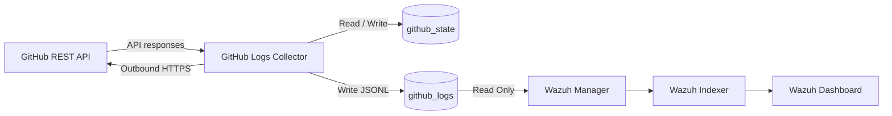

# Wazuh Integration Guide

This guide describes how to integrate **GitHub Logs Collector** with a Docker-based Wazuh deployment.

GitHub Logs Collector remains independent of Wazuh and writes structured JSONL events to a persistent Docker volume.

The Wazuh manager receives **read-only** access to the same volume and monitors the resulting event file using Wazuh Logcollector.

---

# Architecture



No direct Docker network connection between GitHub Logs Collector and Wazuh is normally required.

The integration occurs through the shared `github_logs` Docker volume.

---

# Requirements

Before beginning, ensure:

* GitHub Logs Collector is built or available as a container image.
* The collector can authenticate successfully to GitHub.
* The collector can reach `https://api.github.com`.
* Docker Compose is being used for the Wazuh deployment.
* You have permission to modify the Wazuh manager configuration.
* The collector and Wazuh manager are running on the same Docker host when using a shared local named volume.

---

# Files Provided

This directory contains:

```text
examples/wazuh/
├── README.md
├── ossec-localfile.xml
└── local_rules.xml
```

`ossec-localfile.xml` contains the Wazuh Logcollector configuration.

`local_rules.xml` contains example Wazuh detection rules for GitHub activity.

---

# 1. Add the Collector to the Wazuh Compose Project

Add the GitHub Logs Collector service under the existing top-level:

```yaml
services:
```

section of the Wazuh `docker-compose.yml`.

Example:

```yaml
  github-logs-collector:
    image: ghcr.io/webbie003/github-logs-collector:${COLLECTOR_VERSION:-0.2.0}

    container_name: github-logs-collector

    restart: unless-stopped

    # Security / reliability:
    # Uses a minimal init process to correctly forward signals
    # and reap child processes.
    init: true

    # Security:
    # Runtime configuration and GitHub credentials are stored
    # outside the container image.
    env_file:
      - .env

    # Configuration:
    # Defaults can be overridden through .env or shell variables.
    environment:
      POLL_INTERVAL: ${POLL_INTERVAL:-300}
      REQUEST_TIMEOUT: ${REQUEST_TIMEOUT:-20}
      MAX_PAGES: ${MAX_PAGES:-10}
      LOG_LEVEL: ${LOG_LEVEL:-INFO}

    # Security:
    # No inbound ports are published.
    #
    # The collector operates outbound-only and initiates HTTPS
    # connections to the GitHub REST API.
    #
    # ports:
    #   None required.

    # Persistent collector storage.
    volumes:
      # JSONL events consumed by Wazuh.
      - github_logs:/var/log/github

      # SQLite event deduplication and collector state.
      - github_state:/var/lib/github-logs-collector

    # Configuration:
    # Docker Compose creates a default network automatically.
    #
    # Direct connection to the Wazuh backend network is not required
    # when Wazuh consumes events through the shared volume.
    #
    # If a future integration requires direct container-to-container
    # communication, an existing SIEM network may be attached.
    #
    # networks:
    #   - <SIEM_NETWORK>

    # Security:
    # Prevent privilege escalation.
    security_opt:
      - no-new-privileges:true

    # Security:
    # The collector requires no Linux capabilities.
    cap_drop:
      - ALL

    # Security:
    # Make the container root filesystem immutable.
    read_only: true

    # Security:
    # Provide only a small memory-backed writable /tmp.
    tmpfs:
      - /tmp:size=16M,mode=1777

    # Security:
    # Bound process and resource consumption.
    pids_limit: 50
    mem_limit: 128m
    cpus: 0.25

    # Reliability:
    # Allow the collector to exit cleanly.
    stop_grace_period: 30s

    # Security / operations:
    # Prevent Docker operational logs from consuming unlimited disk.
    logging:
      driver: json-file
      options:
        max-size: "20m"
        max-file: "5"

    # Security:
    # Collector is a non-interactive service.
    stdin_open: false
    tty: false
```

---

# 2. Add the Persistent Docker Volumes

Locate the existing top-level:

```yaml
volumes:
```

section in the Wazuh Compose file.

Add:

```yaml
  github_logs:
  github_state:
```

For example:

```yaml
volumes:
  wazuh_api_configuration:
  wazuh_etc:
  wazuh_logs:
  wazuh_queue:
  wazuh_var_multigroups:
  wazuh_integrations:
  wazuh_active_response:
  wazuh_agentless:
  wazuh_wodles:
  filebeat_etc:
  filebeat_var:
  wazuh-indexer-data:

  # GitHub Logs Collector event storage.
  github_logs:

  # GitHub Logs Collector SQLite state.
  github_state:
```

Do not create a second top-level `volumes:` block if one already exists.

Add the new entries to the existing block.

---

# 3. Mount the GitHub Log Volume into Wazuh Manager

Locate the existing:

```yaml
wazuh.manager:
```

service.

Under its existing:

```yaml
volumes:
```

section, add:

```yaml
      - github_logs:/var/log/github:ro
```

Example:

```yaml
  wazuh.manager:
    # Existing Wazuh configuration...

    volumes:
      # Existing Wazuh volumes remain unchanged.

      # Security:
      # Wazuh requires read access only.
      - github_logs:/var/log/github:ro
```

The `:ro` option is intentional.

GitHub Logs Collector owns and writes the event log.

Wazuh only needs to read it.

The resulting access model is:

```text
github-logs-collector
        |
        | Read / Write
        v
   github_logs
        |
        | Read Only
        v
    wazuh.manager
```

---

# 4. Configure the Collector Environment

Add the collector configuration to the deployment `.env`.

Example:

```env
# GitHub Logs Collector
COLLECTOR_VERSION=0.2.0

GITHUB_USERNAME=YOUR_GITHUB_USERNAME

GITHUB_TOKEN=YOUR_GITHUB_TOKEN

POLL_INTERVAL=300

REQUEST_TIMEOUT=20

MAX_PAGES=10

GITHUB_LOG_FILE=/var/log/github/events.jsonl

STATE_DATABASE=/var/lib/github-logs-collector/state.db

GITHUB_API_URL=https://api.github.com

LOG_LEVEL=INFO
```

Protect the `.env` file:

```bash
chmod 600 .env
```

Do not commit it to Git.

---

# 5. Validate the Docker Compose Configuration

Before making any changes to running containers:

```bash
docker compose config
```

A successful command should render the resolved Compose configuration without YAML or interpolation errors.

You can also save the resolved configuration:

```bash
docker compose config > /tmp/wazuh-compose-resolved.yml
```

Check that the collector exists:

```bash
grep -A50 "github-logs-collector:" \
  /tmp/wazuh-compose-resolved.yml
```

Check the volume declarations:

```bash
grep -A10 "^volumes:" \
  /tmp/wazuh-compose-resolved.yml
```

---

# 6. Start the Collector First

Bring up only the collector:

```bash
docker compose up -d github-logs-collector
```

Check:

```bash
docker compose ps github-logs-collector
```

Review logs:

```bash
docker logs github-logs-collector
```

The collector should authenticate to GitHub and begin polling.

---

# 7. Verify Collector Security Controls

Check the effective runtime settings:

```bash
docker inspect github-logs-collector \
  --format 'User={{.Config.User}} ReadonlyRootfs={{.HostConfig.ReadonlyRootfs}} CapDrop={{.HostConfig.CapDrop}}'
```

Expected values should resemble:

```text
User=10001:10001
ReadonlyRootfs=true
CapDrop=[ALL]
```

Verify that no ports are published:

```bash
docker port github-logs-collector
```

No output is expected.

---

# 8. Verify the Collector Output Volume

Check that the Docker volume exists:

```bash
docker volume ls | grep github
```

Inspect:

```bash
docker volume inspect \
  <COMPOSE_PROJECT_NAME>_github_logs
```

Docker Compose normally prefixes named volumes with the Compose project name unless an explicit volume name is configured.

---

# 9. Verify Events Are Being Written

Inside the collector:

```bash
docker exec github-logs-collector \
  ls -l /var/log/github
```

Then:

```bash
docker exec github-logs-collector \
  tail -n 5 /var/log/github/events.jsonl
```

Each line should contain one complete JSON object.

Example:

```json
{"@timestamp":"2026-08-12T03:00:00Z","collector":{"name":"github-logs-collector","mode":"poll"},"source":{"type":"github","dataset":"account_event"},"github":{"event_id":"123456789","event":"PushEvent","repository":"example/example","actor":"example-user"},"payload":{}}
```

---

# 10. Configure Wazuh Log Collection

Add the contents of:

```text
examples/wazuh/ossec-localfile.xml
```

to the Wazuh manager configuration.

The required configuration is:

```xml
<localfile>
  <log_format>json</log_format>
  <location>/var/log/github/events.jsonl</location>
</localfile>
```

This instructs Wazuh Logcollector to monitor the collector JSONL file.

---

# 11. Docker Wazuh Configuration Location

Docker-based Wazuh deployments often persist `ossec.conf` through a host-side bind mount or configuration directory.

Modify the persistent Wazuh configuration used by Docker rather than editing only the running container.

Editing files directly inside a running container may be lost when the container is recreated.

After modifying the configuration, confirm that the expected configuration exists inside the manager:

```bash
docker exec \
  <WAZUH_MANAGER_CONTAINER> \
  grep -A4 -B2 \
  "/var/log/github/events.jsonl" \
  /var/ossec/etc/ossec.conf
```

Replace:

```text
<WAZUH_MANAGER_CONTAINER>
```

with the actual container name.

---

# 12. Recreate the Wazuh Manager

Because the manager now requires a new Docker volume mount, a simple restart is not sufficient for the initial integration.

Recreate the manager:

```bash
docker compose up -d --force-recreate wazuh.manager
```

Use the actual Compose service name if it differs.

Recreating the container applies the new volume mount while preserving named-volume data.

---

# 13. Verify Wazuh Can See the Collector Log

Run:

```bash
docker exec \
  <WAZUH_MANAGER_CONTAINER> \
  ls -ld /var/log/github
```

Then:

```bash
docker exec \
  <WAZUH_MANAGER_CONTAINER> \
  ls -l /var/log/github
```

And:

```bash
docker exec \
  <WAZUH_MANAGER_CONTAINER> \
  tail -n 5 /var/log/github/events.jsonl
```

Wazuh should be able to read the same events written by the collector.

---

# 14. Install the Example Wazuh Rules

The supplied rule file is:

```text
examples/wazuh/local_rules.xml
```

The example rules include detection logic for:

* GitHub account activity
* Push events
* Pull request events
* Repository reference changes
* Dependabot alerts
* Code scanning alerts
* Secret scanning alerts

Before installing them, review the rule IDs to ensure they do not conflict with existing custom rules.

---

# 15. Example Rules

The supplied rules use a custom range similar to:

```text
110100 - 110199
```

Administrators may change this range to match their own Wazuh custom-rule allocation.

Example base rule:

```xml
<rule id="110100" level="3">
  <decoded_as>json</decoded_as>
  <field name="source.type">github</field>
  <description>GitHub Logs Collector event</description>
</rule>
```

Example push rule:

```xml
<rule id="110101" level="3">
  <if_sid>110100</if_sid>
  <field name="github.event">PushEvent</field>
  <description>GitHub repository push activity</description>
</rule>
```

Example secret scanning rule:

```xml
<rule id="110112" level="10">
  <if_sid>110100</if_sid>
  <field name="source.dataset">security_alert</field>
  <field name="github.event">secret_scanning</field>
  <description>GitHub secret scanning alert</description>
</rule>
```

---

# 16. Install Rules Persistently

For a Docker deployment, install the custom rules through the persistent Wazuh configuration used by the Compose deployment.

Do not rely on modifying only:

```text
/var/ossec/etc/rules/local_rules.xml
```

inside the live container unless that location is backed by persistent storage.

The exact host-side path varies depending on the Wazuh Docker deployment.

---

# 17. Validate Wazuh Configuration

Before relying on the integration, inspect Wazuh manager logs after applying the configuration:

```bash
docker logs \
  <WAZUH_MANAGER_CONTAINER>
```

Look for errors relating to:

```text
rules
localfile
logcollector
XML
configuration
```

Correct configuration errors before proceeding.

---

# 18. Test an Event with `wazuh-logtest`

Extract a single JSONL event from the collector:

```bash
docker exec github-logs-collector \
  tail -n 1 /var/log/github/events.jsonl
```

Copy the complete JSON object.

Start Wazuh rule testing:

```bash
docker exec -it \
  <WAZUH_MANAGER_CONTAINER> \
  /var/ossec/bin/wazuh-logtest
```

Paste the JSON event.

A correctly decoded event should identify JSON fields such as:

```text
source.type
source.dataset
github.event
github.repository
github.actor
```

The expected custom rule should then match.

---

# 19. Example Search Fields

Useful fields for Wazuh searches and dashboards include:

```text
source.type
source.dataset

collector.name
collector.mode

github.event
github.event_id
github.repository
github.actor
github.public
github.alert_number
github.state
```

Examples:

```text
source.type:github
```

```text
github.event:PushEvent
```

```text
source.dataset:security_alert
```

```text
github.event:secret_scanning
```

---

# 20. Verify Wazuh Logcollector

If events exist in:

```text
/var/log/github/events.jsonl
```

but do not appear in Wazuh, inspect manager logs.

For example:

```bash
docker exec \
  <WAZUH_MANAGER_CONTAINER> \
  grep -i github \
  /var/ossec/logs/ossec.log
```

You can also inspect recent Logcollector messages:

```bash
docker exec \
  <WAZUH_MANAGER_CONTAINER> \
  grep -i logcollector \
  /var/ossec/logs/ossec.log | tail -n 50
```

---

# 21. Troubleshooting: File Does Not Exist

If Wazuh reports that:

```text
/var/log/github/events.jsonl
```

does not exist, first check the collector:

```bash
docker exec github-logs-collector \
  ls -l /var/log/github
```

If no file exists, inspect collector logs:

```bash
docker logs github-logs-collector
```

Verify:

* GitHub authentication succeeds
* The configured account is correct
* The API is reachable
* The token has sufficient permissions
* At least one event has been collected

---

# 22. Troubleshooting: Wazuh Cannot See the Volume

Verify the collector mount:

```bash
docker inspect github-logs-collector \
  --format '{{json .Mounts}}'
```

Verify the Wazuh manager mount:

```bash
docker inspect \
  <WAZUH_MANAGER_CONTAINER> \
  --format '{{json .Mounts}}'
```

Both should reference the same Docker volume.

The collector mount should be writable.

The Wazuh manager mount should be read-only.

---

# 23. Troubleshooting: Permission Denied

The collector runs as:

```text
UID 10001
GID 10001
```

If it cannot create:

```text
/var/log/github/events.jsonl
```

or:

```text
/var/lib/github-logs-collector/state.db
```

inspect volume permissions.

Example:

```bash
docker exec github-logs-collector \
  id
```

Then:

```bash
docker exec github-logs-collector \
  ls -ld \
  /var/log/github \
  /var/lib/github-logs-collector
```

---

# 24. Troubleshooting: Duplicate Events

GitHub APIs can return previously seen events during multiple poll cycles.

The collector uses:

```text
/var/lib/github-logs-collector/state.db
```

to track processed event identifiers.

Do not routinely delete the `github_state` volume.

Deleting it resets deduplication history and may cause previously visible GitHub events to be collected again.

---

# 25. Troubleshooting: Security Alerts Missing

Dependabot, code scanning, and secret scanning APIs may be unavailable when:

* The feature is not enabled
* The token lacks permission
* The repository does not support the feature
* The GitHub plan does not provide the feature
* The repository is outside the token's permitted resource scope

Check collector logs:

```bash
docker logs github-logs-collector
```

and verify the GitHub token permissions.

---

# 26. Troubleshooting: API Rate Limits

GitHub applies API rate limits.

Collector logs may expose remaining request capacity without logging authentication secrets.

If rate limits are reached:

* Increase `POLL_INTERVAL`
* Reduce unnecessary collection sources
* Review repository count
* Review `MAX_PAGES`
* Verify that repeated API requests are necessary

---

# 27. Updating the Collector

When a new collector image is released:

```bash
docker compose pull github-logs-collector
```

Then:

```bash
docker compose up -d github-logs-collector
```

The persistent volumes:

```text
github_logs
github_state
```

should remain intact.

Avoid deleting `github_state` during normal upgrades.

---

# 28. Security Recommendations

For a hardened Wazuh integration:

* Give the GitHub token read-only permissions.
* Never store the token in the Docker image.
* Protect `.env` with restrictive permissions.
* Prefer Docker secrets or a dedicated secret manager where practical.
* Do not publish collector ports.
* Keep the collector root filesystem read-only.
* Drop all Linux capabilities.
* Enable `no-new-privileges`.
* Run as the non-root collector user.
* Keep Wazuh access to `github_logs` read-only.
* Protect Wazuh and collector persistent volumes.
* Keep Docker, Wazuh, Python, and collector dependencies updated.
* Review custom Wazuh rule IDs before installation.
* Test rules with `wazuh-logtest` before relying on them for alerting.

---

# 29. Optional Existing Wazuh Network

The shared-volume integration does not require the collector to join the Wazuh Docker network.

If a future feature requires direct container-to-container communication, the collector service can optionally use:

```yaml
networks:
  - wazuh-backend
```

and the existing Docker network can be declared:

```yaml
networks:
  wazuh-backend:
    external: true
```

Replace:

```text
wazuh-backend
```

with the actual existing Wazuh network name.

The network must already exist when:

```yaml
external: true
```

is used.

---

# 30. Final Validation Checklist

After configuration, verify:

```text
GitHub API authentication succeeds
        |
        v
Collector discovers repositories
        |
        v
Collector writes events.jsonl
        |
        v
SQLite state.db is created
        |
        v
Wazuh manager sees github_logs volume
        |
        v
Wazuh can read events.jsonl
        |
        v
JSON fields decode correctly
        |
        v
Custom rules match in wazuh-logtest
        |
        v
Events appear in Wazuh
```

Once all stages are working, the integration is complete.

---

# Related Project Documentation

Main project documentation:

```text
README.md
```

Security documentation:

```text
SECURITY.md
```

Example Wazuh Logcollector configuration:

```text
examples/wazuh/ossec-localfile.xml
```

Example Wazuh custom rules:

```text
examples/wazuh/local_rules.xml
```
